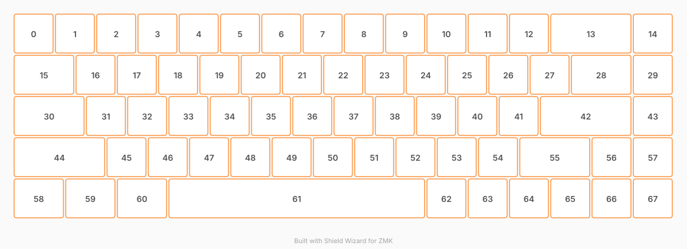

# ZMK Configuration for HandyKeys

*Generated by Shield Wizard for ZMK*



Download compiled firmware from the Actions tab. <https://zmk.dev/docs/user-setup#installing-the-firmware>

Edit your keymap <https://zmk.dev/docs/keymaps>.
User keymap is located at [`config/handykeys.keymap`](config/handykeys.keymap).

-----

<details>
<summary>
Shield Wizard Debug Information
</summary>

In case of broken configuration, here is the Shield Wizard internal data used to generate this configuration:

Commit: 84a348b08cf4fec4a5441a46147e9a345b10ffab

```json
{"name":"HandyKeys","shield":"handykeys","dongle":false,"modules":[],"layout":[{"id":"01M459BG1M4BFABQK8HHAKV6QE","part":0,"row":0,"col":0,"w":1,"h":1,"x":0,"y":0,"r":0,"rx":0,"ry":0},{"id":"01M459BG1MRXT3359QAZKFF2N9","part":0,"row":0,"col":1,"w":1,"h":1,"x":1,"y":0,"r":0,"rx":0,"ry":0},{"id":"01M459BG1M4ZTGB22NZ3T8HZS4","part":0,"row":0,"col":2,"w":1,"h":1,"x":2,"y":0,"r":0,"rx":0,"ry":0},{"id":"01M459BG1MTCH3KXQ9WJ9ARJCJ","part":0,"row":0,"col":3,"w":1,"h":1,"x":3,"y":0,"r":0,"rx":0,"ry":0},{"id":"01M459BG1MB8FN0NTZ7G16CPYW","part":0,"row":0,"col":4,"w":1,"h":1,"x":4,"y":0,"r":0,"rx":0,"ry":0},{"id":"01M459BG1MJXZWVRF0CTFB9B4Y","part":0,"row":0,"col":5,"w":1,"h":1,"x":5,"y":0,"r":0,"rx":0,"ry":0},{"id":"01M459BG1MA76KTSAY5RJS7PJQ","part":0,"row":0,"col":6,"w":1,"h":1,"x":6,"y":0,"r":0,"rx":0,"ry":0},{"id":"01M459BG1M4JH2FG71YYVJ4AZ3","part":0,"row":0,"col":7,"w":1,"h":1,"x":7,"y":0,"r":0,"rx":0,"ry":0},{"id":"01M459BG1MH8A03VQBTH64W39C","part":0,"row":0,"col":8,"w":1,"h":1,"x":8,"y":0,"r":0,"rx":0,"ry":0},{"id":"01M459BG1MMN8EQDV911BG7676","part":0,"row":0,"col":9,"w":1,"h":1,"x":9,"y":0,"r":0,"rx":0,"ry":0},{"id":"01M459BG1MB1YCJS84XSBPXT7D","part":0,"row":0,"col":10,"w":1,"h":1,"x":10,"y":0,"r":0,"rx":0,"ry":0},{"id":"01M459BG1MF1T8XKNV6DXH51FW","part":0,"row":0,"col":11,"w":1,"h":1,"x":11,"y":0,"r":0,"rx":0,"ry":0},{"id":"01M459BG1M71EGD9WSFVXMW0YV","part":0,"row":0,"col":12,"w":1,"h":1,"x":12,"y":0,"r":0,"rx":0,"ry":0},{"id":"01M459BG1MG8DNJW8CMEPN1BFD","part":0,"row":0,"col":13,"w":2,"h":1,"x":13,"y":0,"r":0,"rx":0,"ry":0},{"id":"01M459BG1MHAA7W8KNF12PC7DE","part":0,"row":0,"col":15,"w":1,"h":1,"x":15,"y":0,"r":0,"rx":0,"ry":0},{"id":"01M459BG1MY2TZADKXBHXRZMRX","part":0,"row":1,"col":0,"w":1.5,"h":1,"x":0,"y":1,"r":0,"rx":0,"ry":0},{"id":"01M459BG1MQK427GSY91K12TGA","part":0,"row":1,"col":1,"w":1,"h":1,"x":1.5,"y":1,"r":0,"rx":0,"ry":0},{"id":"01M459BG1MBY7MKH88TH1FF2PP","part":0,"row":1,"col":2,"w":1,"h":1,"x":2.5,"y":1,"r":0,"rx":0,"ry":0},{"id":"01M459BG1MB4RMT8VY1QVQ5N8G","part":0,"row":1,"col":3,"w":1,"h":1,"x":3.5,"y":1,"r":0,"rx":0,"ry":0},{"id":"01M459BG1MDPMRPJDJ4HT37BV7","part":0,"row":1,"col":4,"w":1,"h":1,"x":4.5,"y":1,"r":0,"rx":0,"ry":0},{"id":"01M459BG1M442V1YM9J8CF698M","part":0,"row":1,"col":5,"w":1,"h":1,"x":5.5,"y":1,"r":0,"rx":0,"ry":0},{"id":"01M459BG1MMFD1SGV5KA4TZ2VT","part":0,"row":1,"col":6,"w":1,"h":1,"x":6.5,"y":1,"r":0,"rx":0,"ry":0},{"id":"01M459BG1M2T2TKEV1MPV4HA2Z","part":0,"row":1,"col":7,"w":1,"h":1,"x":7.5,"y":1,"r":0,"rx":0,"ry":0},{"id":"01M459BG1MFTWZB2AVEB6HMJ1A","part":0,"row":1,"col":8,"w":1,"h":1,"x":8.5,"y":1,"r":0,"rx":0,"ry":0},{"id":"01M459BG1MQP4FHXKQRBVCBN1J","part":0,"row":1,"col":9,"w":1,"h":1,"x":9.5,"y":1,"r":0,"rx":0,"ry":0},{"id":"01M459BG1MAD6T4A79GP0JBN2K","part":0,"row":1,"col":10,"w":1,"h":1,"x":10.5,"y":1,"r":0,"rx":0,"ry":0},{"id":"01M459BG1M1H95P6XR7JD0GV81","part":0,"row":1,"col":11,"w":1,"h":1,"x":11.5,"y":1,"r":0,"rx":0,"ry":0},{"id":"01M459BG1MWW6JANR1RQ0PHWFW","part":0,"row":1,"col":12,"w":1,"h":1,"x":12.5,"y":1,"r":0,"rx":0,"ry":0},{"id":"01M459BG1MTHBSPGEY4NHRZ4BR","part":0,"row":1,"col":13,"w":1.5,"h":1,"x":13.5,"y":1,"r":0,"rx":0,"ry":0},{"id":"01M459BG1MYPNW3NDMXN96ZQJB","part":0,"row":1,"col":14,"w":1,"h":1,"x":15,"y":1,"r":0,"rx":0,"ry":0},{"id":"01M459BG1MZ8CHM8GAKQ4MAGBT","part":0,"row":2,"col":0,"w":1.75,"h":1,"x":0,"y":2,"r":0,"rx":0,"ry":0},{"id":"01M459BG1MKQ5542VBQ0JE4C11","part":0,"row":2,"col":1,"w":1,"h":1,"x":1.75,"y":2,"r":0,"rx":0,"ry":0},{"id":"01M459BG1MMFAS4HYGP6QMHQKK","part":0,"row":2,"col":2,"w":1,"h":1,"x":2.75,"y":2,"r":0,"rx":0,"ry":0},{"id":"01M459BG1M92MB3YEWT3XC6XPQ","part":0,"row":2,"col":3,"w":1,"h":1,"x":3.75,"y":2,"r":0,"rx":0,"ry":0},{"id":"01M459BG1MTCB6FWJK7JNT61GT","part":0,"row":2,"col":4,"w":1,"h":1,"x":4.75,"y":2,"r":0,"rx":0,"ry":0},{"id":"01M459BG1MMNX4QRMTWHTVS6ZQ","part":0,"row":2,"col":5,"w":1,"h":1,"x":5.75,"y":2,"r":0,"rx":0,"ry":0},{"id":"01M459BG1M47Z5YHV14XTX99GN","part":0,"row":2,"col":6,"w":1,"h":1,"x":6.75,"y":2,"r":0,"rx":0,"ry":0},{"id":"01M459BG1MG3PGDS8JJR6PDA4A","part":0,"row":2,"col":7,"w":1,"h":1,"x":7.75,"y":2,"r":0,"rx":0,"ry":0},{"id":"01M459BG1MEWA7EZNYT2R86M65","part":0,"row":2,"col":8,"w":1,"h":1,"x":8.75,"y":2,"r":0,"rx":0,"ry":0},{"id":"01M459BG1MJWK74GJH5HAWC2ZA","part":0,"row":2,"col":9,"w":1,"h":1,"x":9.75,"y":2,"r":0,"rx":0,"ry":0},{"id":"01M459BG1MMFN0670P0E6C81GD","part":0,"row":2,"col":10,"w":1,"h":1,"x":10.75,"y":2,"r":0,"rx":0,"ry":0},{"id":"01M459BG1M6DG9Z3W97Z2Q80NH","part":0,"row":2,"col":11,"w":1,"h":1,"x":11.75,"y":2,"r":0,"rx":0,"ry":0},{"id":"01M459BG1M2NJ5W0JAGCSR1QB3","part":0,"row":2,"col":12,"w":2.25,"h":1,"x":12.75,"y":2,"r":0,"rx":0,"ry":0},{"id":"01M459BG1MAHQT8Q2HATG17YS0","part":0,"row":2,"col":13,"w":1,"h":1,"x":15,"y":2,"r":0,"rx":0,"ry":0},{"id":"01M459BG1M7ZQBKCVTYJAKP5DA","part":0,"row":3,"col":0,"w":2.25,"h":1,"x":0,"y":3,"r":0,"rx":0,"ry":0},{"id":"01M459BG1MR8D2XBNS5W6C1BF1","part":0,"row":3,"col":2,"w":1,"h":1,"x":2.25,"y":3,"r":0,"rx":0,"ry":0},{"id":"01M459BG1MDFVW8DDDA9M94X4W","part":0,"row":3,"col":3,"w":1,"h":1,"x":3.25,"y":3,"r":0,"rx":0,"ry":0},{"id":"01M459BG1M6D8BNKPE8Q18RXEE","part":0,"row":3,"col":4,"w":1,"h":1,"x":4.25,"y":3,"r":0,"rx":0,"ry":0},{"id":"01M459BG1MXHG8TQFAV43A8Q3J","part":0,"row":3,"col":5,"w":1,"h":1,"x":5.25,"y":3,"r":0,"rx":0,"ry":0},{"id":"01M459BG1M3MAZ1TH6NZVBS173","part":0,"row":3,"col":6,"w":1,"h":1,"x":6.25,"y":3,"r":0,"rx":0,"ry":0},{"id":"01M459BG1M152D1X4RXXDRRV6A","part":0,"row":3,"col":7,"w":1,"h":1,"x":7.25,"y":3,"r":0,"rx":0,"ry":0},{"id":"01M459BG1MQ2F2NT3HQZ5WJDNE","part":0,"row":3,"col":8,"w":1,"h":1,"x":8.25,"y":3,"r":0,"rx":0,"ry":0},{"id":"01M459BG1MXRZFEP2215780MZC","part":0,"row":3,"col":9,"w":1,"h":1,"x":9.25,"y":3,"r":0,"rx":0,"ry":0},{"id":"01M459BG1MFNXWTCE4ZQ2E4NKE","part":0,"row":3,"col":10,"w":1,"h":1,"x":10.25,"y":3,"r":0,"rx":0,"ry":0},{"id":"01M459BG1M32QQ4QB6WEV4JH9G","part":0,"row":3,"col":11,"w":1,"h":1,"x":11.25,"y":3,"r":0,"rx":0,"ry":0},{"id":"01M459BG1M7HHC47853PK6K7TC","part":0,"row":3,"col":12,"w":1.75,"h":1,"x":12.25,"y":3,"r":0,"rx":0,"ry":0},{"id":"01M459BG1MFHA1D57GAV6V58XJ","part":0,"row":3,"col":14,"w":1,"h":1,"x":14,"y":3,"r":0,"rx":0,"ry":0},{"id":"01M459BG1MTV1FRB83YNQ8H2TG","part":0,"row":3,"col":15,"w":1,"h":1,"x":15,"y":3,"r":0,"rx":0,"ry":0},{"id":"01M459BG1MA2V2H7W3HKC0TK1V","part":0,"row":4,"col":0,"w":1.25,"h":1,"x":0,"y":4,"r":0,"rx":0,"ry":0},{"id":"01M459BG1MG5CT7ME9P4N66X0F","part":0,"row":4,"col":1,"w":1.25,"h":1,"x":1.25,"y":4,"r":0,"rx":0,"ry":0},{"id":"01M459BG1M9HV3BHW8W4TV8HJ6","part":0,"row":4,"col":2,"w":1.25,"h":1,"x":2.5,"y":4,"r":0,"rx":0,"ry":0},{"id":"01M459BG1M7PTKP9G20N9393N2","part":0,"row":4,"col":3,"w":6.25,"h":1,"x":3.75,"y":4,"r":0,"rx":0,"ry":0},{"id":"01M459BG1MP03RXH2T16TDEZGF","part":0,"row":4,"col":4,"w":1,"h":1,"x":10,"y":4,"r":0,"rx":0,"ry":0},{"id":"01M459BG1MHN3TSC2PBHDNVYK6","part":0,"row":4,"col":5,"w":1,"h":1,"x":11,"y":4,"r":0,"rx":0,"ry":0},{"id":"01M459BG1M3YCF6JWWP9YEAWS2","part":0,"row":4,"col":6,"w":1,"h":1,"x":12,"y":4,"r":0,"rx":0,"ry":0},{"id":"01M459BG1M1RDTH32HD4DGAJP9","part":0,"row":4,"col":7,"w":1,"h":1,"x":13,"y":4,"r":0,"rx":0,"ry":0},{"id":"01M459BG1M3JD9554MP4V3W1F6","part":0,"row":4,"col":8,"w":1,"h":1,"x":14,"y":4,"r":0,"rx":0,"ry":0},{"id":"01M459BG1M74XAT67K823WRX0B","part":0,"row":4,"col":9,"w":1,"h":1,"x":15,"y":4,"r":0,"rx":0,"ry":0}],"parts":[{"name":"unibody","controller":"nice_nano_v2","pins":{"d1":{"usage":"kscan","kscan":"01M459C5PKQSH8M8JS3MCWH3JG","role":"input"},"d0":{"usage":"kscan","kscan":"01M459C5PKQSH8M8JS3MCWH3JG","role":"input"},"d2":{"usage":"kscan","kscan":"01M459C5PKQSH8M8JS3MCWH3JG","role":"input"},"d3":{"usage":"kscan","kscan":"01M459C5PKQSH8M8JS3MCWH3JG","role":"input"},"d4":{"usage":"kscan","kscan":"01M459C5PKQSH8M8JS3MCWH3JG","role":"input"},"d21":{"usage":"kscan","kscan":"01M459C5PKQSH8M8JS3MCWH3JG","role":"output"},"d20":{"usage":"kscan","kscan":"01M459C5PKQSH8M8JS3MCWH3JG","role":"output"},"d19":{"usage":"kscan","kscan":"01M459C5PKQSH8M8JS3MCWH3JG","role":"output"},"d18":{"usage":"kscan","kscan":"01M459C5PKQSH8M8JS3MCWH3JG","role":"output"},"d15":{"usage":"kscan","kscan":"01M459C5PKQSH8M8JS3MCWH3JG","role":"output"},"d14":{"usage":"kscan","kscan":"01M459C5PKQSH8M8JS3MCWH3JG","role":"output"},"d16":{"usage":"kscan","kscan":"01M459C5PKQSH8M8JS3MCWH3JG","role":"output"},"d10":{"usage":"kscan","kscan":"01M459C5PKQSH8M8JS3MCWH3JG","role":"output"},"p107":{"usage":"kscan","kscan":"01M459C5PKQSH8M8JS3MCWH3JG","role":"output"},"p102":{"usage":"kscan","kscan":"01M459C5PKQSH8M8JS3MCWH3JG","role":"output"},"p101":{"usage":"kscan","kscan":"01M459C5PKQSH8M8JS3MCWH3JG","role":"output"},"d9":{"usage":"kscan","kscan":"01M459C5PKQSH8M8JS3MCWH3JG","role":"output"},"d8":{"usage":"kscan","kscan":"01M459C5PKQSH8M8JS3MCWH3JG","role":"output"},"d6":{"usage":"kscan","kscan":"01M459C5PKQSH8M8JS3MCWH3JG","role":"output"},"d7":{"usage":"kscan","kscan":"01M459C5PKQSH8M8JS3MCWH3JG","role":"output"}},"kscans":[{"kind":"matrix","id":"01M459C5PKQSH8M8JS3MCWH3JG","diodes":true}],"keys":{"01M459BG1M4BFABQK8HHAKV6QE":{"input":"d1","output":"d6"},"01M459BG1MRXT3359QAZKFF2N9":{"input":"d1","output":"d7"},"01M459BG1M4ZTGB22NZ3T8HZS4":{"input":"d1","output":"d8"},"01M459BG1MTCH3KXQ9WJ9ARJCJ":{"input":"d1","output":"d9"},"01M459BG1MB8FN0NTZ7G16CPYW":{"input":"d1","output":"p101"},"01M459BG1MJXZWVRF0CTFB9B4Y":{"input":"d1","output":"p102"},"01M459BG1MA76KTSAY5RJS7PJQ":{"input":"d1","output":"p107"},"01M459BG1M4JH2FG71YYVJ4AZ3":{"input":"d1","output":"d10"},"01M459BG1MH8A03VQBTH64W39C":{"input":"d1","output":"d16"},"01M459BG1MMN8EQDV911BG7676":{"input":"d1","output":"d14"},"01M459BG1MB1YCJS84XSBPXT7D":{"input":"d1","output":"d15"},"01M459BG1MF1T8XKNV6DXH51FW":{"input":"d1","output":"d18"},"01M459BG1M71EGD9WSFVXMW0YV":{"input":"d1","output":"d19"},"01M459BG1MG8DNJW8CMEPN1BFD":{"input":"d1","output":"d20"},"01M459BG1MHAA7W8KNF12PC7DE":{"input":"d1","output":"d21"},"01M459BG1MY2TZADKXBHXRZMRX":{"input":"d0","output":"d6"},"01M459BG1MQK427GSY91K12TGA":{"input":"d0","output":"d7"},"01M459BG1MBY7MKH88TH1FF2PP":{"input":"d0","output":"d8"},"01M459BG1MB4RMT8VY1QVQ5N8G":{"input":"d0","output":"d9"},"01M459BG1MDPMRPJDJ4HT37BV7":{"input":"d0","output":"p101"},"01M459BG1M442V1YM9J8CF698M":{"input":"d0","output":"p102"},"01M459BG1MMFD1SGV5KA4TZ2VT":{"input":"d0","output":"p107"},"01M459BG1M2T2TKEV1MPV4HA2Z":{"input":"d0","output":"d10"},"01M459BG1MFTWZB2AVEB6HMJ1A":{"input":"d0","output":"d16"},"01M459BG1MQP4FHXKQRBVCBN1J":{"input":"d0","output":"d14"},"01M459BG1MAD6T4A79GP0JBN2K":{"input":"d0","output":"d15"},"01M459BG1M1H95P6XR7JD0GV81":{"input":"d0","output":"d18"},"01M459BG1MWW6JANR1RQ0PHWFW":{"input":"d0","output":"d19"},"01M459BG1MTHBSPGEY4NHRZ4BR":{"input":"d0","output":"d20"},"01M459BG1MYPNW3NDMXN96ZQJB":{"input":"d0","output":"d21"},"01M459BG1MZ8CHM8GAKQ4MAGBT":{"input":"d2","output":"d6"},"01M459BG1MKQ5542VBQ0JE4C11":{"input":"d2","output":"d8"},"01M459BG1MMFAS4HYGP6QMHQKK":{"input":"d2","output":"d9"},"01M459BG1M92MB3YEWT3XC6XPQ":{"input":"d2","output":"p101"},"01M459BG1MTCB6FWJK7JNT61GT":{"input":"d2","output":"p102"},"01M459BG1MMNX4QRMTWHTVS6ZQ":{"input":"d2","output":"p107"},"01M459BG1M47Z5YHV14XTX99GN":{"input":"d2","output":"d10"},"01M459BG1MG3PGDS8JJR6PDA4A":{"input":"d2","output":"d16"},"01M459BG1MEWA7EZNYT2R86M65":{"input":"d2","output":"d14"},"01M459BG1MJWK74GJH5HAWC2ZA":{"input":"d2","output":"d15"},"01M459BG1MMFN0670P0E6C81GD":{"input":"d2","output":"d18"},"01M459BG1M6DG9Z3W97Z2Q80NH":{"input":"d2","output":"d19"},"01M459BG1M2NJ5W0JAGCSR1QB3":{"input":"d2","output":"d20"},"01M459BG1MAHQT8Q2HATG17YS0":{"input":"d2","output":"d21"},"01M459BG1M7ZQBKCVTYJAKP5DA":{"input":"d3","output":"d7"},"01M459BG1MR8D2XBNS5W6C1BF1":{"input":"d3","output":"d8"},"01M459BG1MDFVW8DDDA9M94X4W":{"input":"d3","output":"d9"},"01M459BG1M6D8BNKPE8Q18RXEE":{"input":"d3","output":"p101"},"01M459BG1MXHG8TQFAV43A8Q3J":{"input":"d3","output":"p102"},"01M459BG1M3MAZ1TH6NZVBS173":{"input":"d3","output":"p107"},"01M459BG1M152D1X4RXXDRRV6A":{"input":"d3","output":"d10"},"01M459BG1MQ2F2NT3HQZ5WJDNE":{"input":"d3","output":"d16"},"01M459BG1MXRZFEP2215780MZC":{"input":"d3","output":"d14"},"01M459BG1MFNXWTCE4ZQ2E4NKE":{"input":"d3","output":"d15"},"01M459BG1M32QQ4QB6WEV4JH9G":{"input":"d3","output":"d18"},"01M459BG1M7HHC47853PK6K7TC":{"input":"d3","output":"d19"},"01M459BG1MFHA1D57GAV6V58XJ":{"input":"d3","output":"d20"},"01M459BG1MTV1FRB83YNQ8H2TG":{"input":"d3","output":"d21"},"01M459BG1MA2V2H7W3HKC0TK1V":{"input":"d4","output":"d6"},"01M459BG1MG5CT7ME9P4N66X0F":{"input":"d4","output":"d7"},"01M459BG1M9HV3BHW8W4TV8HJ6":{"input":"d4","output":"d8"},"01M459BG1M7PTKP9G20N9393N2":{"input":"d4","output":"d10"},"01M459BG1MP03RXH2T16TDEZGF":{"input":"d4","output":"d14"},"01M459BG1MHN3TSC2PBHDNVYK6":{"input":"d4","output":"d15"},"01M459BG1M3YCF6JWWP9YEAWS2":{"input":"d4","output":"d18"},"01M459BG1M1RDTH32HD4DGAJP9":{"input":"d4","output":"d19"},"01M459BG1M3JD9554MP4V3W1F6":{"input":"d4","output":"d20"},"01M459BG1M74XAT67K823WRX0B":{"input":"d4","output":"d21"}},"encoders":[],"buses":{}}]}
```

</details>
